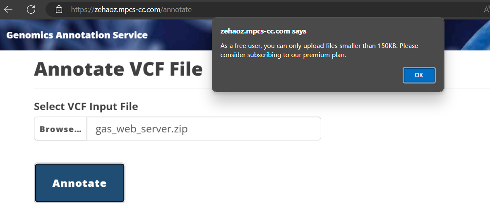

# gas-framework
An enhanced web framework (based on [Flask](http://flask.pocoo.org/)) for use in the capstone project. Adds robust user authentication (via [Globus Auth](https://docs.globus.org/api/auth)), modular templates, and some simple styling based on [Bootstrap](http://getbootstrap.com/).

Directory contents are as follows:
* `/web` - The GAS web app files
* `/ann` - Annotator files
* `/util` - Utility scripts for notifications, archival, and restoration
* `/aws` - AWS user data files

## Archive Process

The archive process is implemented in the `archive.py` script. This script:

1. Receives messages from an SQS queue containing details about completed annotation jobs.
2. For each message, it checks the user's role. If the user is a Free user, it moves the result file from S3 to Glacier.
3. Updates the DynamoDB table to track the archival status and stores the Glacier archive ID.
4. Deletes the processed message from the SQS queue.

## Restore Process

The restore process is implemented in the `restore.py` script. This script:

1. Receives messages from an SQS queue when a user upgrades to the Premium tier.
2. For each message, it queries the DynamoDB table to get all of the user's archived jobs.
3. For each archived job, it initiates a restore job using Glacier's `initiate_job` method. It first attempts to use the Expedited retrieval option, and if that fails due to a policy restriction, it falls back to the Standard retrieval option.
4. Publishes a message to an SNS topic to notify the `thaw.py` script that a restore job has been initiated.
5. Deletes the processed message from the SQS queue.

## Thaw Process

The thaw process is implemented in the `thaw.py` script. This script:

1. Receives messages from an SQS queue when a Glacier restore job is completed.
2. For each message, it checks the status of the restore job using Glacier's `describe_job` method.
3. If the job is completed, it retrieves the restored file from Glacier using `get_job_output`.
4. Uploads the restored file back to S3.
5. Updates the DynamoDB table, removing the `results_file_archive_id` attribute and resetting the `s3_key_result_file` attribute.
6. Deletes the processed message from the SQS queue.

## Notes

During the implementation of this project, I encountered a few challenges:

1. Ensuring the correct format of messages being sent to and received from SQS queues. Inconsistencies here can cause the `archive.py` and `thaw.py` scripts to fail when parsing messages.
2. Managing IAM permissions for the various scripts. Each script needs specific permissions to interact with the necessary AWS services (SQS, S3, Glacier, DynamoDB), and missing permissions can lead to failures.
3. Handling the asynchronous nature of Glacier jobs. The `thaw.py` script needs to correctly handle scenarios where the restore job is not yet complete.

## Extra Credit
